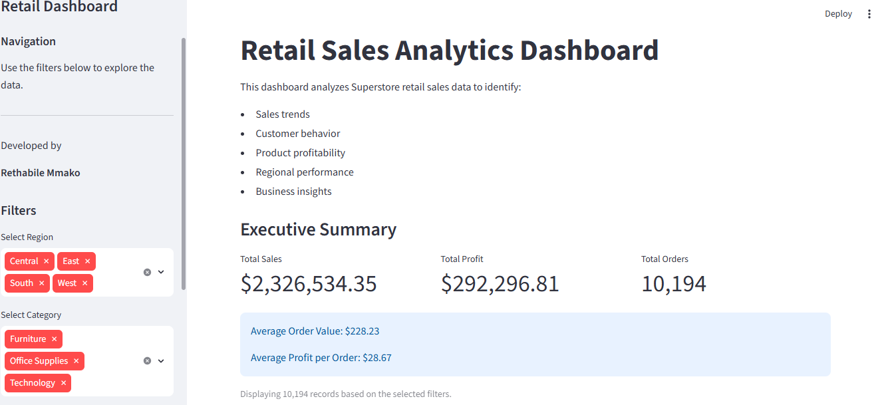
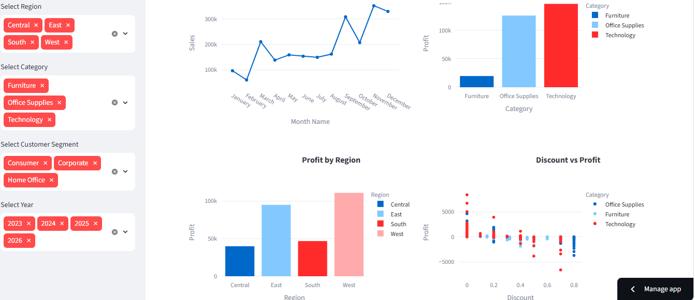
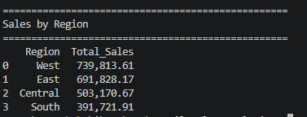

# 📊 Retail Sales Analytics Dashboard

An interactive Business Intelligence dashboard built with **Python, Pandas, SQL, Plotly and Streamlit**.

This project analyzes Superstore retail sales data to discover sales trends, profitability, customer behaviour and product performance.

---

## 🌐 Live Demo

https://retail-sales-analytics-tsvbqinwxo5i5lcqcyhpkn.streamlit.app/

## 💻 GitHub Repository

https://github.com/thabi1405/Retail-Sales-Analytics

# 🚀 Features

- Interactive Streamlit dashboard
- Executive KPI cards
- Dynamic filters
- SQL analysis using SQLite
- Interactive Plotly charts
- Business insights
- Data cleaning with Pandas

---
# 📊 Dashboard

## Dashboard Overview



The dashboard provides:

- Executive KPI cards
- Interactive filters
- Monthly sales trends
- Profit analysis
- Customer insights

---

## Interactive Analytics

Users can filter the dashboard by:

- Region
- Category
- Customer Segment
- Year



---

## SQL Integration

The project stores the cleaned data in SQLite and performs business analysis using SQL.

Example SQL queries include:

- Top profitable products
- Average shipping time
- Profit by region
- Monthly sales



## 👥 Customer Analysis

- Customer Segment Performance
- Top Customers

## 📦 Product Analysis

- Profit by Sub-Category
- Top Profitable Products
- Least Profitable Products

---

# 🗄 SQL Analysis

This project includes SQL queries to answer business questions such as:

- Total Sales
- Total Profit
- Profit by Region
- Sales by Category
- Top Customers
- Most Profitable Products
- Average Shipping Days

Example SQL query:

```sql
SELECT Category,
SUM(Sales) AS Total_Sales
FROM sales
GROUP BY Category
ORDER BY Total_Sales DESC;
```

---

# 🛠 Technologies Used

- Python
- Pandas
- Streamlit
- Plotly
- SQLite
- SQL
- Git
- GitHub

---

# 📂 Project Structure

```
Retail-Sales-Analytics/
│
├── app.py
├── README.md
├── requirements.txt
├── .gitignore
│
├── data/
├── database/
├── outputs/
├── sql/
└── src/
```

---

# ▶️ Run the Project

Install the required packages

```bash
pip install -r requirements.txt
```

Run the dashboard

```bash
streamlit run app.py
```

---

# 👨‍💻 Author

**Rethabile Mmako**

BSc Mathematical Sciences

Computer Science & Statistics

Sefako Makgatho Health Sciences University

---

# ⭐ Future Improvements

- Machine Learning Sales Forecasting
- Customer Segmentation
- Power BI Dashboard
- Cloud Database Integration